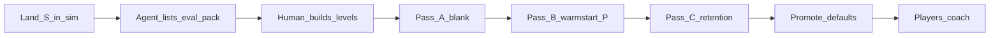

# Skill Ladder (Engine Fine-Tuning)

How major skill families relate when fine-tuning the **training engine**. Operational CLI steps live in [Engine Protocol](engine_protocol.md). Level *lists* live in [Eval Packs](eval_packs.md).

---

## 1. Two loops

| Loop | Who | Goal |
| :--- | :--- | :--- |
| **Engine fine-tune** | Developer / agentic AI | Better trainer defaults + sim; measured on eval packs |
| **Player coaching** | Player | Better Delver **weights** on levels they choose |

Fine-tuning on a simple pack does **not** teach complex gauntlets by itself. It makes coaching those gauntlets more likely to succeed under sane HPs/rewards.

---

## 2. Skill dependence

Later families **assume** earlier ones (traps and puzzles need movement / platforming). “All skills at once” means defaults (and policies) that work on **combo** maps — not three isolated specialists.

Hard new skills often need a **P-capable baseline Delver** when measuring the engine (Pass B below). Blank agents on hard trap/puzzle maps mostly fail at moving, so Optuna would optimize the wrong failure.

---

## 3. Formula for each new major skill **S**

Let **P** = prior skill families already in the training sim and previously fine-tuned (empty when S = platforming).

```text
1. Land S in the training sim (else stop).
2. Human builds the eval pack from the Eval Packs formula
   (agent must list those levels first — see Engine Protocol).
3. Engine passes:
   Pass A — blank / weak agent on S_isolated (and trivial-P maps)
            → isolate the S reward / death signal
   Pass B — warm-start from a P-capable baseline on S_on_P + S_combo
            → measure S when movement (and prior skills) already work
   Pass C — retention on P_retention (prior-only maps)
            → do not collapse old skills
4. Promote config.toml only if S improves and Pass C holds.
5. Players coach with the new engine afterward.
```



When **P** is empty (first family: platforming), skip Pass B’s warm-start requirement; Pass A on the platforming skill pack is enough.

---

## 4. Worked ladder

| Stage | S | P | Notes |
| :--- | :--- | :--- | :--- |
| 1 | Platforming | ∅ | Current [platforming eval instance](eval_packs.md#instance-platforming); Pass A only |
| 2 | Traps | {platforming} | Pass A: trivial-platform + trap; Pass B: platform-master on trap/combo; Pass C: platform retention |
| 3 | Puzzles | {platforming, traps?} | Same pattern; include pairwise and fuller combos |
| 4 | Physics handling (or other) | all prior in sim | Same formula |

Apply the **same** formula for every later family; only S, P, and the concrete level list change.
