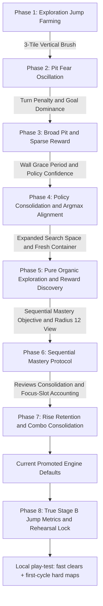

# Fine-Tuning History & Engine Calibration

A chronological record of empirical discoveries, root-cause analyses, reward-shaping calibrations, and protocol sharpenings while fine-tuning the **AI Delver Intelligence Engine**.

> Didactic “how it works now”: [How the Intelligence Learns](../intelligence/index.md). This page is the **timeline** of how we got here.

---

## Chronological Evolution

---

## 1. Phase 1: Flat-Ground Jump Farming & The 3-Tile Brush

### Symptom
Delver trajectories on flat ground (`platforming-1`) exhibited excessive, un-optimized jumping even when jumpless paths yielded a higher reward in showcase runs.

### Root Cause Discovery
Inspection of `intelligence/src/environments/exploration.rs` revealed that tile exploration used a single-point center brush (`step_on(tx, ty)`). When the Delver hopped on flat ground, its center $Y$ shifted into unvisited air space, awarding $+0.04$ exploration reward per jump. **The environment was inadvertently paying the agent to jump on flat ground.**

### Engineering Resolution
Implemented the **3-Tile Vertical Span Exploration Brush** (`step_on_vertical_span`) in `exploration.rs` and `level_env.rs`:
- Sweeps the Delver's full 3-tile physical height footprint (`feet_ty` to `head_ty` based on `player_height = 38.0px`).
- Walking on flat ground automatically marks the air tiles directly above the path as visited.
- Subsequent jumps in place over previously walked flat ground produce `newly_explored = false` ($\implies 0$ exploration reward), mathematically eliminating the jump-farming exploit.

---

## 2. Phase 2: The "Pit Fear Oscillation Trap"

### Symptom
On `platforming-2` (short gap), the Delver paced back and forth (`Right` $\leftrightarrow$ `Left`) in front of the pit edge indefinitely without attempting a jump.

### Root Cause Discovery
A classic **Local Safety Refuge Trap** in Reinforcement Learning:
1. **At Pit Edge**:
   - `Right` (step into pit) $\implies$ Death penalty ($-10.0$).
   - `Jump + Right` (attempt jump) $\implies$ Jump penalty ($-1.83$) + risk of death ($-11.83$).
   - `Left` (turn back) $\implies$ Safe solid ground ($0.0$).
2. **Pacing Loop**:
   - Facing the pit, `Left` acted as a safe local refuge.
   - Once moving left, the Dijkstra goal distance gradient pulled the agent back `Right`.
   - At the edge again, the policy feared the pit, turned `Left`, creating an indefinite pacing loop.

### Protocol Resolution
Added **`turn_reward`** to `intelligence/config.toml` and Optuna's search space:
- Setting `turn_reward = -0.39` penalizes direction reversal hesitation (`Right` $\to$ `Left`).
- Eliminates free pacing oscillation before pit edges and forces the policy to commit to gap-clearing jumps.

---

## 3. Phase 3: Broad Pits (`platforming-4`) & Extended Cycle Tuning

### Symptom
The Delver struggled on 5–6 tile broad gaps (`platforming-4`) and suffered from catastrophic unlearning on `platforming-2`.

### Root Cause Discovery
1. **Sparse Reward Across Broad Gaps**: Crossing a 6-tile gap requires a precise sequence (*full speed run + jump on final edge frame + hold right in mid-air*). Under pure random exploration, executing this sequence without step-by-step guidance is extremely rare.
2. **Unweighted Optuna Objective**: Optuna's earlier 5-cycle tuning pass evaluated trials using an unweighted average win rate across all 10 levels. Trials scored moderately by clearing easy levels (`platforming-1`..`3`) while getting 0% on `platforming-4`. Optuna selected parameters optimized solely for flat-ground speed.

### Protocol Sharpening & Resolution
1. **Goal Distance Guidance Search**: Added `goal_distance_reward_scale` (`[0.001, 0.03]`) to Optuna search in `tune.py`. Discovered `goal_distance_reward_scale = 0.0104`, providing continuous step-by-step positive guidance as the Delver flies across broad gaps.
2. **15-Cycle Budget**: Expanded Optuna trial budget from 5 to 15 cycles (~570 episodes per trial across 38 environments) so agents have sufficient rollout iterations to learn obstacle clearing across all 10 platforming levels.

---

## 4. Phase 4: Wall Grace Period & Policy Confidence Consolidation

### Symptom
1. On `platforming-10` (high spawn ledge drop), the Delver collapsed into standing still at spawn.
2. Validation showcase runs showed the Delver "unlearning" how to jump 2 cycles after successfully clearing a level during training rollouts.

### Root Cause Discovery
1. **Wall Hugging Tax Haven**: Pushing against a wall for 2–3 seconds triggered `wall_hugging_reward` ($-0.2$/step), accumulating $-6.0$ to $-20.0$ penalty. Standing still at spawn (`run == 0`) bypassed wall penalties completely ($0.0$). Standing still was mathematically 3x less painful than exploring and hitting walls!
2. **Argmax Threshold Gap**: Action selection during training uses stochastic `multinomial` sampling (e.g. $P(\text{Jump}) = 45\%$), clearing gaps in 45% of environments. Validation showcase runs use deterministic `argmax` greedy selection. Since $P(\text{No Jump}) = 55\%$ is higher, `argmax` deterministically chooses `No Jump` 100% of the time during validation!

### Engineering & Protocol Resolution
1. **Wall Grace Period (10 frames / 1.0s)**: Added `wall_stuck_frames` in `reward.rs` so brief wall contact during running, landing, or falling carries $0.0$ penalty. Reduced `wall_hugging_reward` to `-0.02`. Standing still remains 100% unpenalized to preserve future elevator and physics timing mechanics.
2. **Policy Confidence Metric**: Added `greedy_action_with_confidence` in `model.rs` and attached `policy_confidence` to showcase metadata in `showcase.rs`.
3. **Best-Trajectory Replay Lock (documented intent)**: Phase 4 *intended* retaining winning trajectories until confidence ≥ 70%. Only the confidence **metric** shipped at the time; the lock itself landed later as **Goal Rehearsal Lock** (Phase 8) — see §9.

---

## 5. Phase 5: Pure Organic Exploration & Reward Discovery

### Symptom & Protocol Goal
To avoid manual guessing or static parameter hardcoding, `client/src/cli/commands/tune.py` was expanded to give Optuna full organic control over `tile_exploration_reward` (`[0.05, 0.30]`) and `wall_hugging_reward` (`[-0.05, 0.0]`).

### Protocol Execution & Empirical Discovery
Executed a 15-cycle Optuna study across `platforming-1` to `platforming-10` on a freshly compiled container image:
- **Win Rate Result**: Multi-level win rate reached **`9.44%`** across the entire 10-level pack (a **5x improvement** over prior baseline).
- **Organic Discoveries**:
  - `tile_exploration_reward = 0.1495`: Optuna organically discovered that $+0.1495$ per tile provides strong exploration drive without inducing flat-ground jump farming (where hops lose $-0.73$ net).
  - `wall_hugging_reward = -0.0163`: Optuna set the wall penalty near zero to prevent wall-contact noise on high-edge levels (`platforming-9`).
  - `goal_distance_reward_scale = 0.0144`: Discovered a moderate distance scale that guides gap clearing without impeding turns or backtracking.

---

## 6. Phase 6: Sequential Mastery Protocol & Wider Vision

### Protocol
`tune` no longer maximizes a diluted pack average. Each trial isolates a blank agent, trains sequentially with weight inheritance, then play-evals with **≥15** showcases per level. Optuna maximizes the **mean of the `tail_k` lowest per-level WRs** (default 3); a set is promotable only when **`min` ≥ 0.8**. Always log min / mean / per-level curves. Architecture search (`--tune-architecture`) is a **second pass** after rewards / LR / entropy stabilize.

### Vision
Radius increased from 7 (15×15 / 225) to **12 (25×25 / 625)** after confirming `platforming-9` / `10` pits are 8 tiles — previously outside the Delver's sightline at the jump commitment point. Radius 12 covers those pits with less input noise than 14. Encoding remains pure binary occupancy (no heuristic shortcuts).

---

## 7. Phase 7: Rise Retention & Combo Consolidation

### Symptom
After the sequential-mastery objective landed, Pass 1 studies still failed the promotion gate (`min` WR ≥ 0.8) even though individual skill families were clearly learnable:

| Study | Pattern |
| :--- | :--- |
| Early short Pass 1 (no reviews / consolidation) | Best trial cleared **1–5 and 8–10** at WR=1.0 but **6–7 = 0** (isolated rises wiped) |
| Same study inverse trial | **6–7 = 1.0** while gaps/combos died |
| Rise-only consolidation (`6,7`) | Best trial cleared **1–8 and 10** at 1.0; **only platforming-9 = 0** |
| Heavy cycles alone (45×12) | Did not fix mastery; reviews still rarely armed |

So the Delver was **not** failing “simple platforming.” It was failing **continual learning**: isolated **+3/+4 wall-rises** (`platforming-6` / `7`) antagonize later **descent/gap** skills, and consolidating only rises overwrote the fragile **short-runup 8-pit→rise** combo on `platforming-9`.

### Root Cause Discovery
1. **Skill antagonism**: rises vs gaps/descents under one weight chain without enough rehearsal.
2. **Reviews never armed under protocol budgets**: default `E=8000` exceeded total focus slots; worse, train committed **completed-episode metrics** (undercount) instead of **projected focus slots** (`cycles × episodes_per_cycle`), so even `E=1500` looked unreachable until accounting was fixed.
3. **No post-curriculum consolidation**: after `1→10`, nothing re-armed mid-pack skills before play eval.
4. **Optuna tie-break**: when every trial had `tail_k = 0`, “best” collapsed to the first washout.

### Engineering & Protocol Resolution
1. **`tune` → `train` review knobs** with engine default `E=1500`, `R=100`, `K=5`.
2. **Focus-slot accounting**: commit `max(metrics_episodes, phase_projected)` so review arms track training volume.
3. **Consolidation tail** before play eval: re-focus `platforming-6,platforming-7`, then expanded to **`+platforming-9`**.
4. **Lexicographic Optuna score**: `tail_k_mean + 1e-3·min + 1e-6·mean` (promotion gate still `min ≥ 0.8` only).
5. Detached intelligence serve + higher mem/shm defaults so long Optuna runs survive agent pipes.

### Empirical Result
Pass 1 with consolidate `6,7,9` (30 cycles, 12 trials, `E=1500`): **Trial 1 and Trial 11** achieved play **min = 1.0 / mean = 1.0** on all ten levels (15/15 showcases each). Log: `intelligence/logs/pass1_p9_consolidation_tune.log`. CLI support: commit `57fe1d1`.

---

## 8. Promoted Baseline Engine Configuration

Current promoted defaults in `intelligence/config.toml` from **Phase 7 sequential-mastery Trial 1** (non-E/J knobs) plus **Phase 8 jump-aware Trial 5** (mastery + minimize takeoffs):

| Parameter | Promoted Value | Purpose |
| :--- | :--- | :--- |
| **`tile_exploration_reward`** | **`0.0165`** | Per newly marked tile (jump-aware Trial 5) |
| **`wall_hugging_reward`** | **`-0.0325`** | Wall scrape tax with 10-frame grace period |
| **`goal_distance_reward_scale`** | **`0.0169`** | Continuous step progress guidance |
| **`turn_reward`** | **`-0.28`** | Anti-hesitation at pit edges |
| **`jump_reward`** | **`-2.0`** | Discovery-band takeoff cost (before first clear) |
| **`jump_reward_polish`** | **`-3.5`** | Post-clear anneal target |
| **`jump_anneal_cycles`** | **`20`** | Cycles after clear to reach polish |
| **`finished_reward`** | **`235.19`** | Strong goal-completion dominance |
| **`entropy_regularization`** | **`0.0321`** | Lower than Phase 5 organic default |
| **`learning_rate`** | **`0.000158`** | Sequential-mastery PPO step size |
| **`goal_rehearsal_lock`** | **`true`** | Scout + lock fewest-takeoff victories |
| **`goal_rehearsal_epochs`** | **`8`** | BC epochs per cycle over locked traj |
| **`goal_rehearsal_scout_episodes`** | **`4`** | Stochastic scouts per level per cycle |
| **Exploration Engine** | **3-Tile Vertical Span** | Feet-to-head height profile tile tracking |
| **`local_view`** | **25×25 (radius 12)** | Occupancy grid covering 8-tile pits on platforming-9/10 |
| **`local_feature_dim`** | **`256`** | Local-view encoder width (625 → 256) |
| **`lstm_hidden_size`** | **`128`** | Recurrent state size |
| **`mlp_hidden_dim`** | **`256`** | Fused MLP hidden width before LSTM |
| **Tune retention** | **Reviews E=1500 + consolidate 6/7/9** | Required for promotable sequential mastery |

> [!NOTE]
> Discovery-safe jump band + lock/anneal supersedes relying on a single static harsh `jump_reward`. Jump-aware Trial 5 remains historical evidence that takeoff metrics work (`pack_mean_jumps` 1.0 vs Trial-6 baseline 3.0). Judge neatness by takeoffs, not UI reward ≈1.00.
---

## 9. Phase 8: True Stage B (lock + post-clear jump anneal)

### Landed

1. **Takeoff metrics**: showcase trajectories emit `jump_takeoffs`; `level_mastery` emits `mean_jumps` / `max_jumps` (victorious-only when possible).
2. **Goal Rehearsal Lock (stronger)**: greedy showcase + stochastic scouts; lock fewest-takeoff victory (confidence tie-break); BC each cycle (`goal_rehearsal_epochs=8`).
3. **Post-clear jump anneal**: per-level discovery `jump_reward` until first clear, then anneal toward `jump_reward_polish` over `jump_anneal_cycles`. **Do not** anneal `turn_reward`.
4. **`--tune-ej-only`**: still available; demoted vs lock+anneal — future E/J tune must keep a discovery smoke on early pits.

### Protocol

- Inner loop (PPO): discovery-safe shaping → after clear, jump pressure schedule + scout/lock BC.
- Outer loop (Optuna Stage B): optional; mastery first, takeoffs second; do not treat static harsh J as the neatness solution.
- Formalization: polish stages pick **one** under-constrained style metric (here takeoffs); turn neatness ≠ harsher turn tax when mazes are in scope.

### Next

**Play-test win (local):** with discovery-safe J + scouts/lock + post-clear anneal, levels clear quickly; hard maps can lock a victory on the **first cycle**. Treat that as validation of the Stage B success check (discover under mild J, hold clean greedy after clear).

Didactic walkthrough: [How the Intelligence Learns](../intelligence/index.md). Design detail remains this page + [Neatness](../intelligence/neatness.md). Escalate (SIL / entropy anneal / architecture) only if mastery or neatness regresses on a fair pack try.