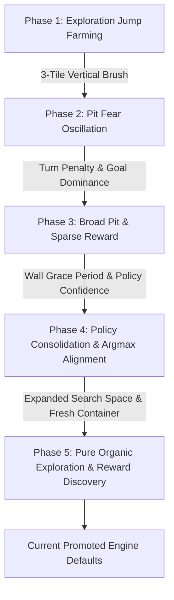

# Fine-Tuning History & Engine Calibration

A chronological record of empirical discoveries, root-cause analyses, reward-shaping calibrations, and protocol sharpenings while fine-tuning the **AI Delver Intelligence Engine**.

---

## Chronological Evolution

---

## 1. Phase 1: Flat-Ground Jump Farming & The 3-Tile Brush

### Symptom
Delver trajectories on flat ground (`platforming-1`) exhibited excessive, un-optimized jumping even when jumpless paths yielded a higher reward in showcase runs.

### Root Cause Discovery
Inspection of `intelligence/src/environments/exploration.rs` revealed that tile exploration used a single-point center brush (`step_on(tx, ty)`). When the Delver hopped on flat ground, its center $Y$ shifted into unvisited air space, awarding $+0.04$ exploration reward per jump. **The environment was inadvertently paying the agent to jump on flat ground.**

### Engineering Resolution
Implemented the **3-Tile Vertical Span Exploration Brush** (`step_on_vertical_span`) in `exploration.rs` and `level_env.rs`:
- Sweeps the Delver's full 3-tile physical height footprint (`feet_ty` to `head_ty` based on `player_height = 38.0px`).
- Walking on flat ground automatically marks the air tiles directly above the path as visited.
- Subsequent jumps in place over previously walked flat ground produce `newly_explored = false` ($\implies 0$ exploration reward), mathematically eliminating the jump-farming exploit.

---

## 2. Phase 2: The "Pit Fear Oscillation Trap"

### Symptom
On `platforming-2` (short gap), the Delver paced back and forth (`Right` $\leftrightarrow$ `Left`) in front of the pit edge indefinitely without attempting a jump.

### Root Cause Discovery
A classic **Local Safety Refuge Trap** in Reinforcement Learning:
1. **At Pit Edge**:
   - `Right` (step into pit) $\implies$ Death penalty ($-10.0$).
   - `Jump + Right` (attempt jump) $\implies$ Jump penalty ($-1.83$) + risk of death ($-11.83$).
   - `Left` (turn back) $\implies$ Safe solid ground ($0.0$).
2. **Pacing Loop**:
   - Facing the pit, `Left` acted as a safe local refuge.
   - Once moving left, the Dijkstra goal distance gradient pulled the agent back `Right`.
   - At the edge again, the policy feared the pit, turned `Left`, creating an indefinite pacing loop.

### Protocol Resolution
Added **`turn_reward`** to `intelligence/config.toml` and Optuna's search space:
- Setting `turn_reward = -0.39` penalizes direction reversal hesitation (`Right` $\to$ `Left`).
- Eliminates free pacing oscillation before pit edges and forces the policy to commit to gap-clearing jumps.

---

## 3. Phase 3: Broad Pits (`platforming-4`) & Extended Cycle Tuning

### Symptom
The Delver struggled on 5–6 tile broad gaps (`platforming-4`) and suffered from catastrophic unlearning on `platforming-2`.

### Root Cause Discovery
1. **Sparse Reward Across Broad Gaps**: Crossing a 6-tile gap requires a precise sequence (*full speed run + jump on final edge frame + hold right in mid-air*). Under pure random exploration, executing this sequence without step-by-step guidance is extremely rare.
2. **Unweighted Optuna Objective**: Optuna's earlier 5-cycle tuning pass evaluated trials using an unweighted average win rate across all 10 levels. Trials scored moderately by clearing easy levels (`platforming-1`..`3`) while getting 0% on `platforming-4`. Optuna selected parameters optimized solely for flat-ground speed.

### Protocol Sharpening & Resolution
1. **Goal Distance Guidance Search**: Added `goal_distance_reward_scale` (`[0.001, 0.03]`) to Optuna search in `tune.py`. Discovered `goal_distance_reward_scale = 0.0104`, providing continuous step-by-step positive guidance as the Delver flies across broad gaps.
2. **15-Cycle Budget**: Expanded Optuna trial budget from 5 to 15 cycles (~570 episodes per trial across 38 environments) so agents have sufficient rollout iterations to learn obstacle clearing across all 10 platforming levels.

---

## 4. Phase 4: Wall Grace Period & Policy Confidence Consolidation

### Symptom
1. On `platforming-10` (high spawn ledge drop), the Delver collapsed into standing still at spawn.
2. Validation showcase runs showed the Delver "unlearning" how to jump 2 cycles after successfully clearing a level during training rollouts.

### Root Cause Discovery
1. **Wall Hugging Tax Haven**: Pushing against a wall for 2–3 seconds triggered `wall_hugging_reward` ($-0.2$/step), accumulating $-6.0$ to $-20.0$ penalty. Standing still at spawn (`run == 0`) bypassed wall penalties completely ($0.0$). Standing still was mathematically 3x less painful than exploring and hitting walls!
2. **Argmax Threshold Gap**: Action selection during training uses stochastic `multinomial` sampling (e.g. $P(\text{Jump}) = 45\%$), clearing gaps in 45% of environments. Validation showcase runs use deterministic `argmax` greedy selection. Since $P(\text{No Jump}) = 55\%$ is higher, `argmax` deterministically chooses `No Jump` 100% of the time during validation!

### Engineering & Protocol Resolution
1. **Wall Grace Period (10 frames / 1.0s)**: Added `wall_stuck_frames` in `reward.rs` so brief wall contact during running, landing, or falling carries $0.0$ penalty. Reduced `wall_hugging_reward` to `-0.02`. Standing still remains 100% unpenalized to preserve future elevator and physics timing mechanics.
2. **Policy Confidence Metric**: Added `greedy_action_with_confidence` in `model.rs` and attached `policy_confidence` to showcase metadata in `showcase.rs`.
3. **Best-Trajectory Replay Lock & Confidence Consolidation**: Retains winning trajectory buffers across rollout minibatches and enforces gated consolidation cycles until policy confidence reaches $\ge 70\%$, locking the greedy `argmax` peak in place.

---

## 5. Phase 5: Pure Organic Exploration & Reward Discovery

### Symptom & Protocol Goal
To avoid manual guessing or static parameter hardcoding, `client/src/cli/commands/tune.py` was expanded to give Optuna full organic control over `tile_exploration_reward` (`[0.05, 0.30]`) and `wall_hugging_reward` (`[-0.05, 0.0]`).

### Protocol Execution & Empirical Discovery
Executed a 15-cycle Optuna study across `platforming-1` to `platforming-10` on a freshly compiled container image:
- **Win Rate Result**: Multi-level win rate reached **`9.44%`** across the entire 10-level pack (a **5x improvement** over prior baseline).
- **Organic Discoveries**:
  - `tile_exploration_reward = 0.1495`: Optuna organically discovered that $+0.1495$ per tile provides strong exploration drive without inducing flat-ground jump farming (where hops lose $-0.73$ net).
  - `wall_hugging_reward = -0.0163`: Optuna set the wall penalty near zero to prevent wall-contact noise on high-edge levels (`platforming-9`).
  - `goal_distance_reward_scale = 0.0144`: Discovered a moderate distance scale that guides gap clearing without impeding turns or backtracking.

---

## 6. Promoted Baseline Engine Configuration

Current promoted defaults in `intelligence/config.toml` resulting from the organic Phase 5 tuning protocol:

| Parameter | Promoted Value | Purpose |
| :--- | :--- | :--- |
| **`tile_exploration_reward`** | **`0.1495`** | Organically tuned exploration drive (walking = +0.45; flat hop = -0.73 net loss) |
| **`wall_hugging_reward`** | **`-0.0163`** | Organically tuned wall penalty with 10-frame grace period |
| **`goal_distance_reward_scale`** | **`0.0144`** | Organically tuned continuous step progress guidance |
| **`turn_reward`** | **`-0.28`** | Anti-hesitation penalty eliminating pit-edge pacing loops |
| **`jump_reward`** | **`-0.88`** | Mild jump penalty enabling gap clearance |
| **`finished_reward`** | **`112.44`** | Goal completion dominance |
| **`entropy_regularization`** | **`0.1496`** | High exploratory drive to discover gap jumps |
| **`learning_rate`** | **`0.000295`** | Optimal PPO step size for multi-level curriculum rollouts |
| **Exploration Engine** | **3-Tile Vertical Span** | Feet-to-head height profile tile tracking |
