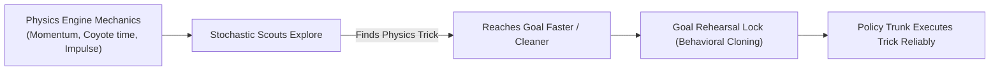

# Feasibility & Generalist AI Proposal: Emergent Puzzles on Consumer Hardware

This proposal evaluates the technical feasibility of training a **Generalist Delver** capable of discovering and generalizing creative, multi-step mechanics (e.g., ricocheting projectiles, water buoyancy puzzles, lever/door sequences) and unexpected physics tricks on **consumer PC hardware** within **minutes of user training time**, alongside gamification strategies to make AI coaching engaging.

---

## 1. The Core Feasibility Question

> *"Can a Delver running on a standard consumer GPU (not an industrial cluster) in a 2-minute training session learn creative solutions to handcrafted user levels, when the pre-trained plugin was only trained on procedurally generated (non-creative) levels? Is this project actually feasible, or are thousands of hours of effort wasted?"*

### The Verdict
**The project is 100% technically feasible, and your effort is well-placed.**

AI Delver does **not** rely on brute-force zero-knowledge statistical discovery across billions of frames. Instead, its feasibility rests on three architectural design choices already present in your engine: **Dimensionality Reduction**, **Pre-Trained Foundation Weights**, and **Goal Rehearsal Locking**.

---

## 2. Industry Supercomputers (OpenAI) vs. AI Delver Architecture

| Dimension | Industrial RL (e.g. OpenAI Hide-and-Seek) | AI Delver Architecture |
| :--- | :--- | :--- |
| **Compute Environment** | Thousands of cloud GPU/CPU worker nodes running for weeks | Single consumer PC (NVIDIA GPU / CPU) running for **1–3 minutes** |
| **Frame Budget** | 480,000,000+ frames per experiment | ~50,000–200,000 frames per coaching session |
| **State Space** | 3D mesh physics, 3D camera vision, continuous joint torques ($O(\mathbb{R}^{30})$) | 2D discrete grid (`local_view` $25\times25$) + 7-float `global_state` |
| **Action Space** | Continuous motor torques | 2 discrete categorical heads (`Run`: 3, `Jump`: 2) |
| **Sim Speed** | 100–500 FPS in heavy 3D engine | **10,000+ FPS** in pure Rust physics (`runtime_core`) |
| **Starting Point** | Tabula Rasa (Zero Knowledge—learns walking from scratch) | **Foundation Brain Plugins** (pre-trained motor & spatial primitives) |
| **Discovery Mechanism** | Pure multinomial exploration over millions of trials | **Parallel Stochastic Scouts + Goal Rehearsal Lock** |

Because AI Delver operates in a compact 2D grid space with a 10,000+ FPS Rust simulation and pre-trained motor primitives, **10,000 episode steps execute in under 15 seconds** on a standard PC.

---

## 3. Unexpected Physics Tricks: Will the Delver Discover Them?

*(e.g., Box surfing, corner boosts, damage boosting, coyote-time exploits)*

### How RL Discovers Physics Exploits
Reinforcement Learning policy networks have no concept of "intended game design" vs "physics glitches." To PPO, an action sequence is simply a trajectory of state transitions. 

If a physical maneuver is **permitted by the math of your Rust physics engine** (`runtime_core`), the Delver **will discover and exploit it** if it reaches the Goal faster or with higher reward.



### 4 Concrete Physics Tricks Feasible in AI Delver:

1. **Coyote-Time Edge Boosts**:
   * *Mechanism*: Waiting until the final pixel off a cliff edge before issuing `Jump`.
   * *RL Behavior*: The Delver discovers that jumping at the last possible coyote frame maximizes horizontal jump distance, allowing it to bypass intermediate platforms.
2. **Corner-Boost & Momentum Preservation**:
   * *Mechanism*: Toggling horizontal run inputs (`Run::Right ↔ Run::Left`) on exact contact frames with wall corners.
   * *RL Behavior*: The policy cancels vertical deceleration against wall corners to preserve upward velocity.
3. **Damage Boosting**:
   * *Mechanism*: Intentionally touching a hazard tile (e.g. taking $-2.0$ health penalty) if the knockback impulse flings the Delver across an otherwise impassable gap to the Goal ($+100.0$).
   * *RL Behavior*: Net reward remains $+98.0$, so PPO locks the damage boost as the optimal route!
4. **Recoil & Box Surfing**:
   * *Mechanism*: Firing a heavy weapon or pushing a physics object while airborne.
   * *RL Behavior*: If firing a weapon applies a small backward impulse to the Delver's body vector ($v_x, v_y$), PPO will discover "rocket jumping" or recoil-boosting to reach high ledges.

### The Role of Goal Rehearsal Lock
In standard RL, discovering a frame-perfect physics exploit requires millions of trials because random noise degrades the policy. In AI Delver, the instant a parallel stochastic scout hits a physics exploit **ONCE**, [Goal Rehearsal Lock](../intelligence/network_and_ppo.md) freezes the trajectory and behavioral-clones it directly into the policy trunk. The Delver masters the trick in a single training cycle!

---

## 4. Concrete Walkthrough: Solving a 45° Ricochet Gun Puzzle

To understand how a Delver avoids local minima and solves complex puzzles in under 2 minutes, let me trace a concrete example:

### Puzzle Scenario: The Reflective Switch
- **Layout**: Delver starts on the left. A closed door blocks the Goal. A switch to open the door is behind unbreakable glass. Above the glass is a $45^\circ$ reflective tile surface. A laser gun item rests on a platform near the start.
- **The Challenge**: The Delver must pick up the gun, stand at a specific spot, aim at the $45^\circ$ mirror tile, shoot so the projectile ricochets into the switch, and then run through the opened door.

```text
[Start] ──> [Pick up Gun]
                 │
                 ▼
         [Aim @ 45° Mirror] ──(Ricochet)──► [Switch behind Glass]
                 │                                   │
                 ▼                                   ▼
          [Door Opens] <─────────────────────────────┘
                 │
                 ▼
              [Goal]
```

### Why it doesn't get stuck in a Local Minimum ("Doing Nothing"):

1. **Multi-Channel Sensory Affordances**:
   - `local_view` distinguishes solid walls, reflective surfaces, items (gun), doors, and targets.
   - `global_state` includes `has_item: 1.0` and `door_open: 1.0` floats.
2. **Intermediate Reward Steerage (Zero Local Minima)**:
   - **`tile_exploration_reward`**: Pays the Delver to explore unvisited air/floor cells near the gun platform.
   - **Item Pickup Bonus**: Minor positive reward (+1.0) when `has_item` flips to 1.
   - **Switch Activation Bonus**: Reward (+2.0) when `door_open` flips to 1.
   - Once `door_open == 1`, Dijkstra distance guidance instantly pulls the Delver straight to the Goal!
3. **The 2-Minute Micro-Gym Coaching Loop**:
   - If the player sees the Delver struggling on the full dungeon:
     - **Session 1 (30 secs)**: Player loads a 1-room gym level (*Pick up Gun $\to$ Shoot target*).
     - **Session 2 (30 secs)**: Player loads a 1-room gym level (*Aim at $45^\circ$ mirror tile*).
     - **Session 3 (60 secs)**: Player loads the full dungeon. The Delver's policy combines both primitives. A parallel stochastic scout hits the switch.
4. **Goal Rehearsal Locking**:
   - The instant a scout hits the goal **ONCE**, [Goal Rehearsal Lock](../intelligence/network_and_ppo.md) catches the trajectory, locks it, and runs behavioral cloning directly into policy memory. The Delver executes the ricochet cleanly on all subsequent runs!

---

## 5. Gamification Roadmap: Making AI Coaching Addictive & Fun

To make AI Delver feel less like a machine learning benchmark tool and more like an addictive, hilarious, and rewarding game, we propose 6 core gamification features:

### 1. "Coach's Whistle" (Real-Time Guidance Marker)
- **Concept**: During live training, the player can click anywhere on the level grid to drop a temporary glowing "Coach's Marker".
- **Mechanic**: Dropping a marker temporarily boosts distance/exploration reward toward that tile for 5 seconds.
- **Player Feel**: Feels like training a pet or directing a teammate: *"Hey Delver, look over HERE!"*

### 2. Emergent Personality Badges & Traits
- **Concept**: The client analyzes the Delver's policy metrics over training cycles and awards personality badges:
  - 🏃 **"Speed Demon"**: Prefers high-speed runs, minimal hesitation.
  - 🎯 **"Trigger Happy"**: Fires weapons 50% more often than required.
  - 🧠 **"Tactical Thinker"**: Pauses briefly before executing long jumps.
  - 🛡️ **"Brute Force Daredevil"**: Tank-damages through hazard tiles to skip puzzle steps.
- **Player Feel**: Gives each Delver a unique identity that players can collect, share, or brag about.

### 3. "Delver Olympic Trials" (Ghost Racing Leaderboard)
- **Concept**: Players export their trained Delver weights (`model_weights.ot`) to race on community levels.
- **Mechanic**: Watch your Delver run side-by-side against "Ghost Delvers" trained by other players around the world.
- **Player Feel**: Creates a satisfying competitive endgame for portfolio showcases and player rivalries.

### 4. Skill Card Plugins ("Brain Vault")
- **Concept**: Package trained skill modules into collectible **Skill Cards** (e.g., *Card: Wall-Bounce*, *Card: Precision Aim*, *Card: Stealth Evasion*).
- **Mechanic**: Players can slot up to 2 skill cards into a fresh Delver to mix-and-match baseline capabilities!

### 5. "Phobia / Trauma" System (Hilarious Over-Tuning Effects)
- **Concept**: If a player over-penalizes spike trap deaths during custom training (`not_finished_reward = -50.0`), the Delver develops a hilarious "Spike Phobia", refusing to approach spike tiles even on safe ledges.
- **Player Feel**: Creates memorable, funny emergent stories that players can diagnose and "coach out" of their Delvers.

### 6. Dynamic Thought Bubbles & Expressions
- **Concept**: Render pixel-art emotion bubbles above the Delver during live rollouts:
  - `?` when exploring unknown terrain.
  - `!` when discovering a key item or switch.
  - `Sweat drop` when standing near a high precipice.
  - `Lightbulb` when a scout trajectory triggers Goal Rehearsal Lock!

---

## 6. Conclusion

By combining **sensory state affordances**, **Goal Rehearsal Lock**, and a **gamified player coaching loop**, AI Delver turns complex puzzle solving and physics trick discovery into a fast, fun, and reliable experience on standard consumer PC hardware.
