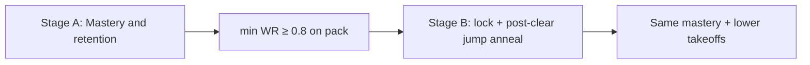
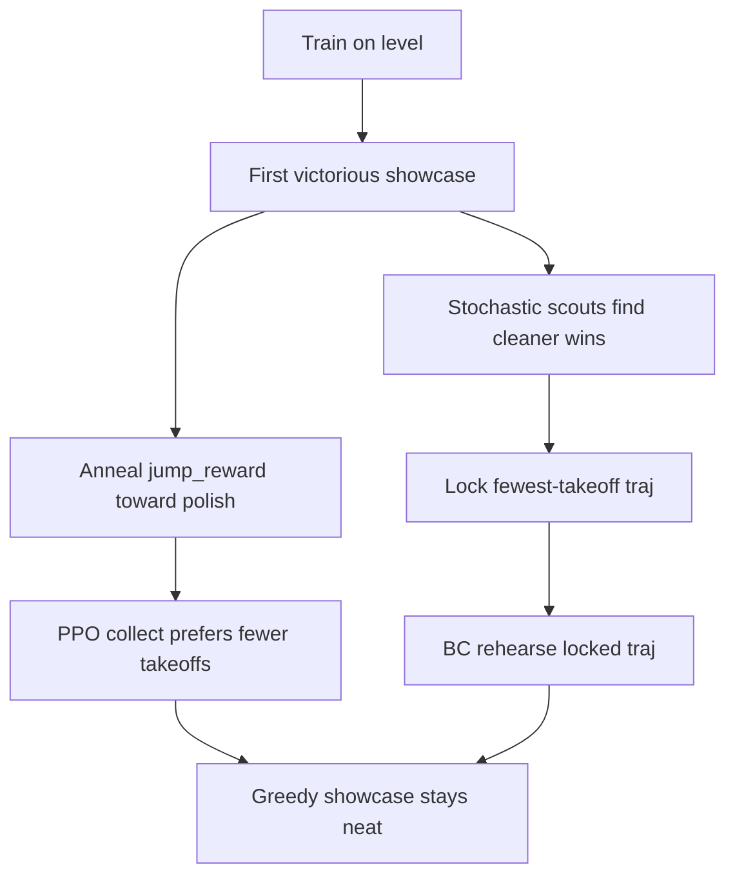

# Stage B: Jump Cleanliness Polish

Design deep-dive for post-mastery jump frugality on `platforming-1`…`platforming-10`.

> For the didactic path (recommended first read): [Neatness](../intelligence/neatness.md) and [How the Intelligence Learns](../intelligence/index.md).

Stage A (Phase 7) proved the Delver can **master** the pack under pure vision RL. Stage B asks: keep that mastery while making trajectories **as jump-frugal as possible**.

Related: [Fine-Tuning History](fine_tuning_history.md), [Engine Protocol](../agentic_fine_tuning/engine_protocol.md), [Run Types](run_types.md).

---

## 1. Why Stage A alone is not enough

| Pressure | What it wants | Effect on `jump_reward` |
| :--- | :--- | :--- |
| **Discovery** | Invent gap commits, wall-rises | Milder penalty so stochastic exploration tries Jump |
| **Clean play** | Walk when walking works | Stronger penalty so flat hops lose |

Stage A Optuna maximized **sequential mastery** (tail-k / min WR), not neatness. Finish (~235) dwarfs takeoff cost (~2–3), so after `reward_scale` jumpy and neat wins both show ~`1.00` UI reward. Mild jump cost + entropy still yields argmax policies that **clear every level while jumping more than needed**.

**Conclusion:** discovery and cleanliness are **two objectives**. A single static “magic” `jump_reward` is mostly an illusion. Stage B **sidesteps** that constant by changing *when* jump pressure applies and by locking clean wins.



---

## 2. Non-negotiables

1. **Pure vision RL** — no scripted “no jump on flat” heuristics.
2. Standing still / backtracking stay unpenalized.
3. Success still requires sequential mastery (`min` WR ≥ 0.8).
4. Do not demote Stage A until Stage B produces a mastery-preserving **cleaner** set (lower pack mean takeoffs).
5. **Do not anneal `turn_reward`** the same way — labyrinths need many intentional turns. Neatness polish here is **jump-takeoff focused**.

---

## 3. What “clean” means (measurable)

From **play-mode** argmax showcases (not training multinomial):

- **`jump_takeoffs`**: count of takeoff impulses (same signal as `jump_reward`), emitted on trajectory JSON.
- Per-level **`mean_jumps` / `max_jumps`** on `level_mastery` (victorious-only average when any wins exist).
- **`pack_mean_jumps`**: mean of per-level `mean_jumps` across the curriculum.

Do **not** count held jump frames for Optuna — one gap commit held in air is not “many jumps.”

Showcase = **current** weights’ argmax, not “best trajectory ever.” Clean-then-jumpy regressions under continued training are **weight drift** ([Run Types](run_types.md) §4), not showcase exploring.

---

## 4. Primary levers (landed): Rehearsal Lock + Post-Clear Jump Anneal

### Lever A — Goal Rehearsal Lock (scouts + BC)

Config (`intelligence/config.toml`):

- `goal_rehearsal_lock = true`
- `goal_rehearsal_epochs = 8`
- `goal_rehearsal_scout_episodes = 4`

Behavior:

1. After each cycle: greedy showcase + `K` stochastic scouts.
2. Lock the fewest-takeoff **victory** among them (strictly fewer takeoffs, or equal takeoffs with higher `policy_confidence`).
3. Each cycle, behavioral-clone (`Ppo::rehearse`) locked trajectories for `goal_rehearsal_epochs`.
4. Training collect stays stochastic; rehearsal sticks argmax to the clean win even when return near-ties.

No flat-floor ban — only observed clean wins are reinforced.

### Lever B — Per-level post-clear jump anneal

Config:

- `jump_reward` — discovery-band takeoff cost (e.g. `-2.0`) until a level’s first victorious showcase this train session.
- `jump_reward_polish` — harsher target after clear (e.g. `-3.5`).
- `jump_anneal_cycles` — cycles after first clear to interpolate discovery → polish.

### Lever C — Post-clear entropy anneal

Config:

- `entropy_regularization` — discovery band (e.g. `0.06`) so blank agents escape idle/left spawn collapse.
- `entropy_regularization_polish` — lower target after clear (e.g. `0.025`) so neat argmax converges faster.
- `entropy_anneal_cycles` — often shorter than jump anneal (e.g. `12`).

Session rule: entropy stays at discovery until **every** coach level in the `/train` call has cleared, then anneals using the slowest level’s cycles-since-clear.

Rules (jump + entropy):

1. Track whether each coach level has ever produced a victorious showcase this train call.
2. Before first clear: use discovery `jump_reward` / `entropy_regularization`.
3. After first clear: interpolate toward polish targets over the anneal cycle spans.
4. New `/train` call (coach level change) starts discovery band again.
5. **Do not** anneal `turn_reward`.

This is “mild until win, then schedule pressure” — compatible with pure vision and future mazes.



---

## 5. Secondary / demoted: static harsh J via Optuna

`--tune-ej-only` still exists for searching discovery-band E/J under a **mastery lock**, then minimizing pack mean takeoffs. It is **not** the preferred neatness lever anymore.

If you re-run E/J Optuna:

1. Keep a **discovery smoke** on early pit levels (blank agent must still invent gap jumps under proposed `jump_reward`).
2. Prefer promoting a discovery-safe `jump_reward` plus lock+anneal polish knobs — not a forever-harsh static J that blocks first clears.
3. Promote only if mastery holds **and** pack mean takeoffs beat the prior baseline.

```bash
poetry run python src/cli/main.py tune \
  --tune-ej-only \
  --levels "platforming-1,...,platforming-10" \
  --cycles 20 \
  --episodes-per-cycle 24 \
  --trials 8 \
  --eval-runs 15 \
  --consolidate-levels "platforming-6,platforming-7,platforming-9" \
  --focus-episodes-between-passes 1500 \
  --agent engine_eval_agent \
  --server localhost:8001
```

---

## 6. Accounting prerequisites (landed)

1. `jump_reward` once per takeoff impulse.
2. Per newly marked tile explore pay.
3. Trajectory + `level_mastery` expose takeoff stats for Optuna.

---

## 7. Formalization (why jump, not every neatness signal)

Pattern for polish stages:

1. **Mastery lock** (play WR).
2. **One under-constrained style metric** matching the current failure mode.
3. **Rehearse** wins that are good on that metric; optionally **schedule** the matching reward after clear.

Jump takeoffs are Stage B’s metric because flat hop spam is the observed bug and return barely ranks neat vs jumpy. Elapsed frames / turn counts stay as PPO shaping until they become an explicit later polish stage. **Turn neatness ≠ harsher `turn_reward`** when mazes are in scope.

---

## 8. Risks

1. Anneal too fast / polish too harsh → pit-fear on rises / `platforming-9` — keep consolidate + reviews; widen discovery band if first clears stall.
2. Confusing train jumps with play takeoffs — Optuna uses play mastery only.
3. Rehearsal overfitting to one neat path — still require full-pack mastery before promote; monitor lock churn / confidence.
4. Scouts never see a cleaner win → lock sticks on “clear +1 hop”; escalate later (SIL / stronger ranking) only after a fair local try.

---

## 9. Success check

Treat success as: **discover under mild J, then hold clean greedy play after clear** — not “Optuna found the one true J.”
