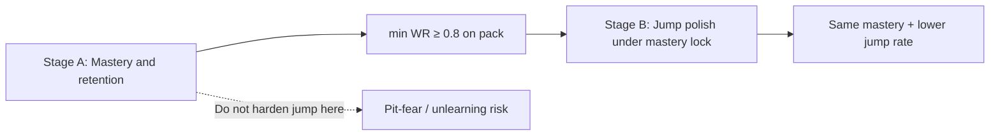

# Stage B: Jump Cleanliness Polish

Design note for the **next** engine fine-tuning stage after sequential mastery on `platforming-1`…`platforming-10`.

Stage A (Phase 7) proved the Delver can **master** the pack under pure vision RL. Stage B asks a different question: can we keep that mastery while making trajectories **as jump-frugal and clean as possible**?

Related: [Fine-Tuning History](fine_tuning_history.md) §7–§9, [Engine Protocol](../agentic_fine_tuning/engine_protocol.md), [Run Types](run_types.md).

---

## 1. The dilemma (why Stage A alone is not enough)

| Pressure | What it wants | Effect on `jump_reward` |
| :--- | :--- | :--- |
| **Discovery** | Invent gap commits, wall-rises, coyote-tight combos | Milder penalty (e.g. promoted `-0.67`) so stochastic exploration tries Jump |
| **Clean play** | Walk when walking works; jump only when geometry demands it | Stronger penalty so flat hops and “nervous” air spam lose |

Stage A Optuna maximized **sequential mastery** (tail-k / min WR), not neatness. Mild jump cost + residual entropy still yields argmax policies that **clear every level while jumping more than a skilled human**.

Cranking `jump_reward` harder **inside the same blank-agent discovery pass** historically recreates **pit-fear** (Phase 2): at a gap edge, Jump looks worse than turn-away, and the agent never learns the skill.

**Conclusion:** discovery and cleanliness are **two objectives**. Solve them in **two stages**, not one scalar.



---

## 2. Non-negotiables (philosophy)

Carry forward from the engine protocol:

1. **Pure vision RL** — `local_view` (25×25) + `global_state` only. No scripted jump rules, no goal painted into the grid, no action overrides.
2. **Standing still stays unpenalized** — elevators / timing later.
3. **Backtracking stays unpenalized** — mazes later.
4. **Success still means sequential mastery** — play **min WR ≥ 0.8** (prefer ≥ 0.8 with full per-level table). Diluted means do not promote.
5. **Do not demote Stage A** until Stage B produces a mastery-preserving cleaner set.

---

## 3. What “clean” means (measurable)

Define jump cleanliness from **play-mode** showcases (argmax), not from training multinomial rollouts.

### Primary cleanliness metric

For each level, over `eval_runs` (default **15**) victorious play trajectories (or all trajectories if we also care about failed spam):

- **`jumps_per_episode`**: count of action steps where the jump bit is asserted (same signal the GUI labels “Jump”).
- **`jump_rate`**: `jumps_per_episode / episode_length` (optional length-normalized).
- Pack summary: **mean** and **max** of per-level mean `jumps_per_episode` (max catches one messy level).

### Mastery lock

- Per-level play WR, **min**, **mean**, full table — identical to Stage A promotion gate.
- A Stage B candidate is **infeasible** if `min < 0.8` (or a chosen stricter bar such as `min ≥ 0.9` once Stage A is solid).

### Ranking among feasible trials

Lexicographic (example):

1. Feasible under mastery lock.
2. Minimize pack **mean jumps_per_episode** (or max).
3. Tie-break: higher min WR, then higher mean WR, then lower entropy / more negative jump cost for reproducibility notes.

Do **not** optimize jump rate without the mastery constraint — that recovers “never jump, fail gaps.”

---

## 4. Recommended Stage B procedure

### 4.1 Starting point

Prefer **warm-start** from a Stage A mastered agent (e.g. `engine_eval_agent_trial_1` weights that cleared all ten at WR=1.0), not a blank brain:

- Skills already exist in weights.
- Polish is about **reshaping preferences** (when Jump wins under argmax), not rediscovering geometry from scratch.

Blank-agent Stage B is allowed as a control, but expect higher risk of unlearning under harsh jump cost.

### 4.2 Search levers (small space)

Keep Stage A retention knobs on (`E=1500`, consolidate `platforming-6,7,9` unless warm-start + short polish proves reviews unnecessary).

Search primarily:

| Lever | Stage A promoted | Stage B search (suggested) |
| :--- | :--- | :--- |
| `jump_reward` | `-0.67` | more negative, e.g. `[-2.5, -0.67]` |
| `entropy_regularization` | `0.0321` | lower or similar, e.g. `[0.005, 0.04]` |
| `learning_rate` | `0.000158` | equal or slightly lower for polish, e.g. `[5e-5, 1.6e-4]` |

Hold fixed initially: `finished_reward`, `turn_reward`, `tile_exploration_reward`, `wall_hugging_reward`, `goal_distance_reward_scale`, network widths (Pass 2 architecture stays out unless polish stalls).

### 4.3 Budget

Shorter than Stage A discovery:

- Warm-start polish: **10–20 cycles** per level (or a single multi-level mix with reviews), **8–12 trials**.
- Always `--eval-runs ≥ 15` for stable WRs and jump stats.
- Keep `--mode static`.

### 4.4 Objective sketch

```text
if min_play_WR < mastery_threshold:
    score = -1  # or prune / huge penalty
else:
    score = -mean_jumps_per_episode   # maximize in Optuna ⇒ minimize jumps
    # optional: score += tiny bonus for min_WR / mean_WR
```

Promotion: mastery lock **and** mean jump rate **strictly better** than Stage A baseline measured the same way on the promoted defaults.

### 4.5 Instrumentation (likely code work before the study)

Today showcases expose actions to the trajectory viewer; Stage B needs **aggregated jump counts in CLI JSON** (e.g. extend `level_mastery` or a `play_style` event with `jumps`, `frames`, `victorious`). Without that, Optuna cannot rank cleanliness automatically.

Minimal path:

1. Count jump bits while collecting play trajectories.
2. Emit per-level means into tune’s mastery / completed payload.
3. Document the formula in the tune log.

---

## 5. Alternatives considered (and when to use them)

| Idea | Pros | Cons | Verdict |
| :--- | :--- | :--- | :--- |
| Harden `jump_reward` in Stage A only | One pass | Pit-fear; loses mastery | **Reject** |
| Anneal jump cost inside one trial (schedule) | Single agent lifetime | Hard to Optuna; schedule is a new hyperparam | Later experiment |
| Heuristic “no jump on flat” | Instantly clean | Violates pure vision philosophy | **Reject** |
| Goal Rehearsal Lock on lowest-jump wins | Solidifies clean successes | Needs Stage B metrics + replay infra | Complement after polish works |
| Pass 2 `--tune-architecture` for cleanliness | More capacity | Wrong lever for “when to jump” preference | Only if polish cannot hold mastery |

---

## 6. Risks

1. **Unlearning rises / platforming-9** under harsh jump cost — keep consolidation + reviews; watch per-level table every trial.
2. **Confusing training jumps with play jumps** — metrics must come from `--play` argmax showcases.
3. **Optimizing jump count on failures** — prefer victorious-only averages, or weight by victory.
4. **Overfitting to pack** — Stage B still must clear all ten; do not score only `platforming-1` flat neatness.

---

## 7. Discussion checklist (before implementing)

Use this when deciding how strict Stage B should be:

1. **Mastery bar:** keep `0.8`, or raise to `0.9` / `1.0` because Stage A already hit `1.0`?
2. **Warm-start vs blank:** default warm-start from Trial 1 weights?
3. **Jump metric:** raw jump actions vs jumps only while grounded vs jump_rate?
4. **Search width:** jump+entropy only, or also LR / exploration?
5. **Instrumentation first:** block the Optuna run until CLI emits jump stats?
6. **Promote rule:** replace Stage A defaults only if cleaner **and** mastery-locked?

---

## 8. Suggested first implementation slice

When ready to execute (separate from this design doc):

1. Add play-eval jump counters to CLI mastery JSON.
2. Measure **Stage A baseline** jump stats under current promoted `config.toml` (same 15 showcases × 10 levels).
3. Implement Stage B objective in `tune` (or a `tune --polish-jumps` flag) with mastery lock + minimize jumps.
4. Warm-start study; promote only if cleaner under lock.
5. Append results to [Fine-Tuning History](fine_tuning_history.md) as Phase 8.

Until then, Stage A promoted defaults remain the engine baseline: mastery first, cleanliness next.
