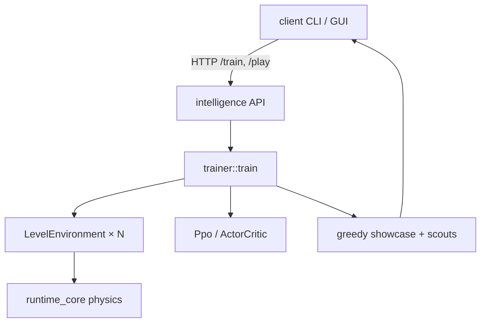

# Big picture

The Delver is not a scripted platformer bot. It is a **policy network** trained with **reinforcement learning** (PPO) inside the `intelligence/` Rust binary.

## Three layers

| Layer | Lives in | Job |
| :--- | :--- | :--- |
| **Physics / world** | `runtime/`, `level/` | Simulate the Delver body, solids, goals |
| **Training engine** | `intelligence/` | Sense → act → reward → learn weights |
| **Coach / CLI / GUI** | `client/` | Pick levels, call `/train`, show trajectories |

Players and agents coach by choosing levels and budgets. The engine decides *how* those episodes become better weights.

## Pure vision RL (non‑negotiable)

The policy may only use:

1. **`local_view`** — a 25×25 binary occupancy grid around the Delver (radius 12).
2. **`global_state`** — a small proprioception / relative-goal vector (7 floats).

There are **no** “don’t jump on flat ground” hardcodes, no pit detectors that force Jump, and no scripted path followers. Standing still and backtracking stay unpenalized (elevators, mazes, timing puzzles later).

Style (e.g. fewer jumps) comes from **rewards + rehearsal**, not from banned actions.

## What “learning a level” means

1. Stochastic rollouts invent behaviors under mild discovery rewards.
2. PPO raises the probability of high-return action sequences.
3. Greedy showcase (argmax) shows what the *current* weights prefer.
4. After a first clear, neatness pressure (jump anneal) + Goal Rehearsal Lock stick clean victories so argmax does not drift back to “clear +1 hop.”

Success for coaching is usually **play / showcase win rate** on the focus level — not the training stochastic win rate alone.

## Key source map

| Concern | Path |
| :--- | :--- |
| Config | `intelligence/config.toml`, `intelligence/src/config.rs` |
| Train loop | `intelligence/src/trainer/loop.rs` |
| Showcase / scouts | `intelligence/src/trainer/showcase.rs` |
| Env step + takeoff | `intelligence/src/environments/level_env.rs` |
| Rewards | `intelligence/src/environments/reward.rs` |
| Observations | `intelligence/src/environments/observation.rs` |
| Network | `intelligence/src/agent/model.rs` |
| PPO + rehearse | `intelligence/src/agent/ppo.rs` |
| HTTP API | `intelligence/src/api/routes.rs` |

Next: [Senses & actions](senses_and_actions.md).
