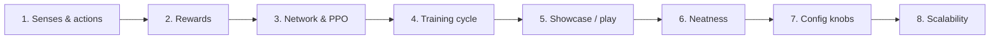

# How the Intelligence Learns

This section explains the **training engine** (`intelligence/`) from the ground up: what the Delver sees, how rewards steer it, how one training cycle works, and how neatness (few jumps) is polished after a first clear.

Read in order the first time. Later chapters are safe to jump to when debugging.

| Chapter | Question it answers |
| :--- | :--- |
| [Big picture](big_picture.md) | What is `intelligence/` vs the client / physics? |
| [Senses & actions](senses_and_actions.md) | What does the agent see and choose? |
| [Rewards](rewards.md) | Why does it want the goal, explore, and avoid spam jumps? |
| [Network & PPO](network_and_ppo.md) | How do weights change from experience? |
| [Training cycle](training_cycle.md) | What happens every cycle, start to finish? |
| [Seeing what it learned](seeing_what_it_learned.md) | Train vs showcase vs play (argmax vs sample) |
| [Neatness](neatness.md) | Discovery → lock → post-clear jump anneal |
| [Config knobs](config_knobs.md) | Which `config.toml` fields matter when? |
| [Scalability](scalability.md) | Will this last for traps, puzzles, physics? |

**Related (not introductory):**

- Chronology of experiments: [Fine-Tuning History](../engineering/fine_tuning_history.md)
- Stage B design deep-dive: [Jump Cleanliness Polish](../engineering/jump_polish_stage_b.md)
- Engine improvement ritual: [Agentic Fine-Tuning](../agentic_fine_tuning/index.md)
- Player coaching / reviews: [Player Curriculum](../player/curriculum.md)
