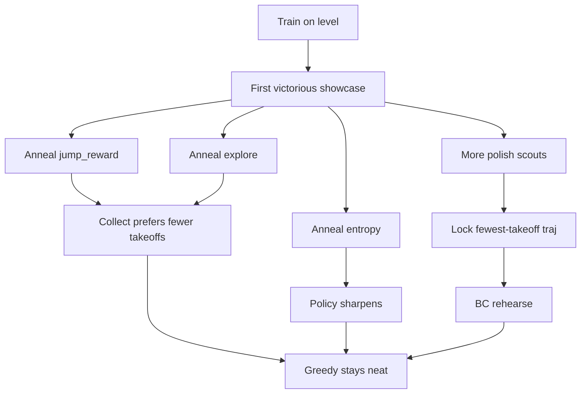

# Neatness: discover, then stick the clean win

Platforming needs **two objectives**:

1. **Discover** gap commits / rises (needs mild jump cost + entropy + explore).
2. **Prefer clean** finishes (few takeoffs) once a clear exists.

A single static “magic” `jump_reward` tries to do both at once and usually fails one side. Stage B sidesteps that with a **schedule + lock**.

Deep design notes: [Stage B: Jump Cleanliness Polish](../engineering/jump_polish_stage_b.md).

> [!IMPORTANT]
> After raising discovery explore to escape spawn-idle, **slow neatness was mostly explore staying hot after clear**, not only entropy. Explore anneals down post-clear; polish scouts hunt cleaner locks harder.

## Lever A — Goal Rehearsal Lock

| Knob | Role |
| :--- | :--- |
| `goal_rehearsal_lock` | Master enable |
| `goal_rehearsal_scout_episodes` | Pre-clear stochastic hunters |
| `goal_rehearsal_scout_episodes_polish` | After clear: more scouts (find 0-hop before BC cements +1) |
| `goal_rehearsal_epochs` | BC passes over the locked traj each cycle |

Lock = fewest victorious takeoffs (confidence tie-break). BC keeps argmax glued to that path while collect stays exploratory.

## Lever B — Post-clear jump anneal

| Knob | Role |
| :--- | :--- |
| `jump_reward` | Discovery band (before first clear) |
| `jump_reward_polish` | Harsher target after clear |
| `jump_anneal_cycles` | How fast to reach polish |

After clear, jumpy on-policy wins look worse in return — **without** making first invents impossible.

**Do not anneal `turn_reward`.** Mazes need cheap intentional turns.

## Lever C — Post-clear entropy anneal

| Knob | Role |
| :--- | :--- |
| `entropy_regularization` | Discovery band (escape idle/left spawn collapse) |
| `entropy_regularization_polish` | Lower target after clear (sharper argmax) |
| `entropy_anneal_cycles` | How fast to sharpen |

## Lever D — Post-clear explore anneal (primary neatness speed)

| Knob | Role |
| :--- | :--- |
| `tile_exploration_reward` | Discovery band (beat spawn-idle) |
| `tile_exploration_reward_polish` | Lower after clear (less hop-into-air farming) |
| `explore_anneal_cycles` | How fast to cool explore (default 8; greedy fail resets to discovery) |

Finish still dwarfs one takeoff; leaving explore at discovery (e.g. `0.075`) after clear keeps PPO sampling jumpy wins. Cooling explore is the main post-clear neatness lever alongside lock coverage. If greedy unlearns, anneal **resets** to discovery so cold polish cannot trap idle/left spawn again.

## Success check

**Discover under mild J / hot explore / hot entropy, then hold clean greedy play after clear** — not “Optuna found the one true J.”

`--tune-ej-only` remains a secondary tool. Prefer discovery-safe J + lock/anneal; if you search E/J again, keep a **discovery smoke** on early pits.

## Pattern to reuse later

For any new style failure (wasteful trap triggers, slow puzzles, …):

1. Keep a **discovery-safe** base signal so the skill can be invented.
2. Define **one measurable polish metric** on victorious play.
3. Optionally **scout + lock + rehearse** clean wins.
4. Optionally **anneal** the matching cost (and any discovery bonus that fights polish) only after first success.
5. Do **not** globally tax behaviors future skills will need (cf. turns / mazes).

Next: [Config knobs](config_knobs.md).
