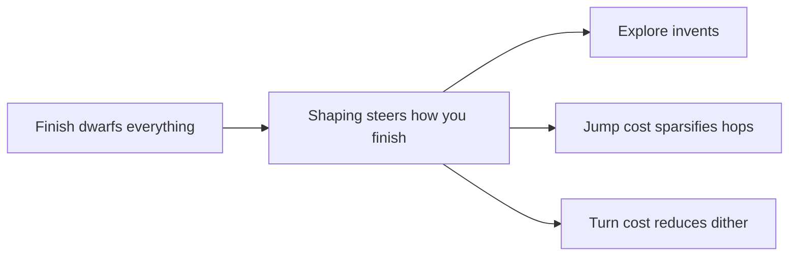

# Rewards

Rewards are the only teacher. Every term lives in `RewardState::calculate` (`environments/reward.rs`) and is **divided by `reward_scale()`** so magnitudes stay comparable for PPO / UI.

> [!TIP]
> The GUI “Reward ≈ 1.00” is mostly **normalized finish**. A few takeoffs barely move two decimal places. Judge jump neatness by **`jump_takeoffs` / `mean_jumps`**, not the big green number.

## Mental model: dominant finish, shaping on the side

| Term | Typical role | Notes |
| :--- | :--- | :--- |
| `finished_reward` | **Win** | Huge positive when the goal is reached |
| `not_finished_reward` | Fail | Timeout / death-style miss |
| `frame_step_reward` | Mild hurry | Per-step time tax |
| `tile_exploration_reward` | Invent routes | Per **newly marked** explore tile (air + floor brush) |
| `goal_distance_reward_scale` | Nudge toward goal | Dijkstra distance progress |
| `turn_reward` | Anti-hesitation | Cost when run direction flips (do **not** anneal for mazes) |
| `jump_reward` | Jump cost | Once per **takeoff**; discovery band until clear |
| `wall_hugging_reward` | Anti-scrape | After a short grounded stuck grace |

## Discovery vs polish (jumps)

`jump_reward` in config is the **discovery band** (mild enough to invent gap commits).

After a level’s first victorious showcase in a train session, the trainer substitutes **annealed** effective jump and explore costs that slide toward polish targets over their anneal cycle spans. Collect envs rebuild each cycle with those effective values.

**`turn_reward` is never annealed the same way.** Labyrinths need many intentional turns; a post-clear turn tax would punish future maze skills.

## What is intentionally *not* punished

- Standing still
- Backtracking

Those stay free so elevators, timing, and maze search remain learnable later.

## Explore accounting

Explore pays **per newly marked tile**, not a boolean “did anything new happen this step.” The vertical brush covers a feet-to-head span so flying through air still marks progress.

Next: [Network & PPO](network_and_ppo.md).
