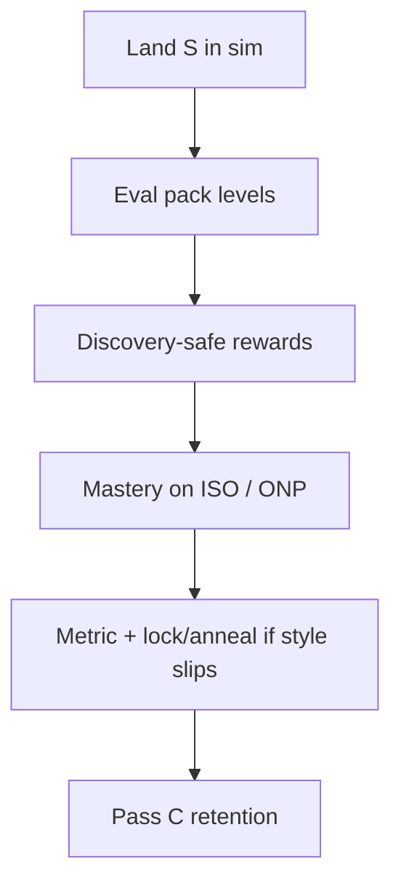

# Scalability: traps, puzzles, physics, …

Short answer: **the pattern scales; the jump-specific knobs do not magically become trap/puzzle intelligence.**

## What travels well

| Idea | Why it lasts |
| :--- | :--- |
| Pure vision + proprioception | New objects need sim rendering into occupancy / globals, not action hardcodes |
| Dominant success signal + mild shaping | Finish/survive still dwarfs style |
| Discover → measure → polish | Every new skill has invent vs neat tradeoffs |
| Scout + lock + rehearse | Sticks rare clean victories when returns near-tie |
| Post-success anneal of **one** cost | Schedules pressure without a forever magic constant |
| Skill ladder Pass A/B/C | Isolates new signals, then retention ([Skill Ladder](../agentic_fine_tuning/skill_ladder.md)) |
| Standing still / backtrack free | Timing, elevators, maze search stay learnable |

## What does *not* automatically transfer

| Jump-era piece | Limit for later features |
| :--- | :--- |
| `jump_reward` / `jump_reward_polish` | Only about takeoffs |
| Takeoff lock metric | Wrong objective for “don’t touch the saw” or “press buttons in order” |
| Flat MLP over 25×25 | May stall on richer geometry; 2D conv is a later experiment |
| One LSTM policy | Can learn combos, but catastrophic forgetting still needs reviews / Pass C |

## How to extend the recipe

For a new family **S** (traps, puzzles, physics props, …):

1. **Sim first** — deaths, triggers, movable props must exist in the training env.
2. **Eval pack** — isolate S, then S-on-platforming, combos, retention ([Eval Packs](../agentic_fine_tuning/eval_packs.md)).
3. **Discovery-safe base** — reward/death that lets blank agents invent S on ISO maps (Pass A).
4. **One polish metric** once clears exist (e.g. trap triggers, puzzle resets, time-to-goal) — not a mirror of every reward term.
5. **Optional lock** on victorious episodes that are good on that metric; optional anneal of the matching cost after first clear.
6. **Do not** globally anneal taxes that later skills need (same lesson as `turn_reward` vs mazes).

## Risks to watch as the world grows

1. **Reward soup** — too many simultaneous polish taxes fight each other; prefer staged polish.
2. **Lock overfitting** — one brittle path; always require pack mastery / retention before promote.
3. **Partial observability** — some puzzles need memory or richer globals; LSTM helps but is not a planning module.
4. **Physics identity** — different bodies/forces may need `delver.toml` / `world.toml` checks, not only RL knobs ([Physics Performance](../engineering/physics_performance.md)).

## Bottom line

What you just shipped is a **general neatness architecture** demonstrated on jumps. Future features should reuse **discover-then-lock/anneal**, swap the metric and the annealed term, and keep the agentic ladder strict on *mastery gates* while staying exploratory on *discovery* search ranges.
