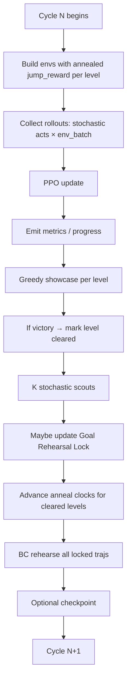

# Training cycle (start to finish)

Everything important happens in `trainer::train` (`trainer/loop.rs`). One **cycle** is one full turn of the outer loop.

## 1. Effective jump cost + entropy for this cycle

For each level hash:

- Never cleared this `/train` call → discovery `jump_reward`.
- Cleared → interpolate toward `jump_reward_polish` by `cycles_since_clear / jump_anneal_cycles`.

Envs are rebuilt every cycle so collect feels the schedule. A new `/train` (coach moves to another level) resets clear/anneal state for that session.

Entropy is **session-wide**: discovery `entropy_regularization` until every coach level has cleared, then anneal toward `entropy_regularization_polish` over `entropy_anneal_cycles` (using the slowest level’s clock).

## 2. Collect

- `env_batch_size` parallel `LevelEnvironment`s.
- Each rollout window lasts `collect_seconds_per_env × actions_per_second` steps.
- Actions: stochastic policy (unless `no_learning`).
- Episodes that finish mid-window reset in place; victories/timeouts counted for metrics.

## 3. PPO update

One `ppo.update(rollout)` (or more rollouts if `episodes_per_cycle` needs several windows). Emits loss / entropy / reward_mean on a `metrics` event.

## 4. Greedy showcase

For each level in the train set, `run_showcase` (argmax) builds a GUI trajectory and reports `jump_takeoffs`, `victorious`, `policy_confidence`.

First victory → `clear_progress` entry (anneal starts after this cycle’s tick).

## 5. Stochastic scouts

If `goal_rehearsal_lock` and `goal_rehearsal_scout_episodes > 0`, run **K** `run_scout` episodes (multinomial). Scouts can find rarer cleaner wins that greedy has not stuck on yet.

## 6. Lock update

Among victorious greedy + scout trajectories, keep the one with:

1. Strictly fewer takeoffs, or
2. Equal takeoffs and higher `policy_confidence`.

Store obs/action tensors as `RehearsalTrajectory`.

## 7. Anneal clock + BC

- Every cleared level’s “cycles since clear” increments once per cycle.
- Each locked traj is `ppo.rehearse(..., goal_rehearsal_epochs)`.

Then the next cycle collects again — now under a slightly harsher jump cost if the level has cleared, and with a policy already tugged toward the locked path.

## Intuition for “learned on cycle 1”

If prior weights already almost solve the map, one collect+update plus a victorious showcase can lock a clean traj immediately. Discovery band J lets the inventing happen; lock+anneal keeps the win neat afterward.

Next: [Seeing what it learned](seeing_what_it_learned.md).
