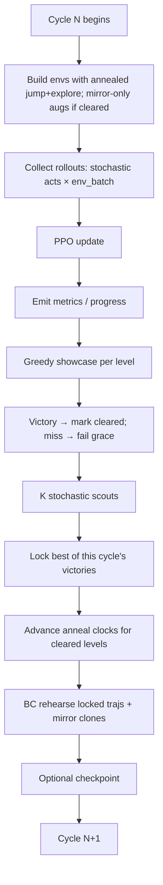

# Training cycle (start to finish)

Everything important happens in `trainer::train` (`trainer/loop.rs`). One **cycle** is one full turn of the outer loop.

## 1. Effective jump + explore + entropy for this cycle

For each level hash:

- Never cleared this `/train` call → discovery `jump_reward` / `tile_exploration_reward` + full train augs.
- Cleared → interpolate toward polish targets over the matching anneal cycle spans; **mirror-only** polish augs (`mirror_augmentation_prob_polish`; jitter/dropout zeroed) so collect stays lock-aligned without killing L↔R equivariance.

Envs are rebuilt every cycle so collect feels the schedule. A new `/train` (coach moves to another level) resets clear/anneal state for that session.

Entropy is **session-wide**: discovery until every coach level has cleared, then anneal toward polish (slowest level’s clock). Scout budget switches to `goal_rehearsal_scout_episodes_polish` per level once that level has cleared.

If the **greedy** showcase fails after a clear, polish holds for `polish_fail_grace` consecutive misses (default **3**); Goal Rehearsal Lock stays. Only after grace trips is clear/anneal reset to discovery — otherwise a single miss on a hard map reheats jump-spam discovery.

## 2. Collect

- `env_batch_size` parallel `LevelEnvironment`s.
- Each rollout window lasts `collect_seconds_per_env × actions_per_second` steps.
- Actions: stochastic policy (unless `no_learning`).
- Episodes that finish mid-window reset in place; victories/timeouts counted for metrics.

## 3. PPO update

One `ppo.update(rollout)` (or more rollouts if `episodes_per_cycle` needs several windows). Emits loss / entropy / reward_mean on a `metrics` event.

## 4. Greedy showcase

For each level in the train set, `run_showcase` (argmax) builds a GUI trajectory and reports `jump_takeoffs`, `victorious`, `policy_confidence`.

First victory → `clear_progress` entry (anneal starts after this cycle’s tick); polish fail streak cleared.

## 5. Stochastic scouts

If `goal_rehearsal_lock`, run **K** `run_scout` episodes (multinomial). Pre-clear `K = goal_rehearsal_scout_episodes`; after that level clears, `K = goal_rehearsal_scout_episodes_polish` (hunt cleaner 0-hop locks harder).

## 6. Lock update (end of level’s greedy+scouts)

Among **this cycle’s** victorious greedy + scout trajectories, pick fewest takeoffs (confidence tie-break), then update the session lock if that candidate beats the prior lock. Avoids mid-cycle “greedy locks high hops → BC → scout finds cleaner” thrash. Misses keep the prior lock.

## 7. Anneal clock + BC

- Every cleared level’s “cycles since clear” increments once per cycle.
- Each locked traj is `ppo.rehearse(..., goal_rehearsal_epochs)`.
- When `goal_rehearsal_mirror_clone` is on, the same epochs also run on a horizontally flipped clone (flip local_view, negate dx/vx, remap run 0↔2).

Then the next cycle collects again — now under a slightly harsher jump cost if the level has cleared, and with a policy already tugged toward the locked path (and its mirror).

## Intuition for “learned on cycle 1”

If prior weights already almost solve the map, one collect+update plus a victorious showcase can lock a clean traj immediately. Discovery band J lets the inventing happen; lock+anneal keeps the win neat afterward.

Next: [Seeing what it learned](seeing_what_it_learned.md).
